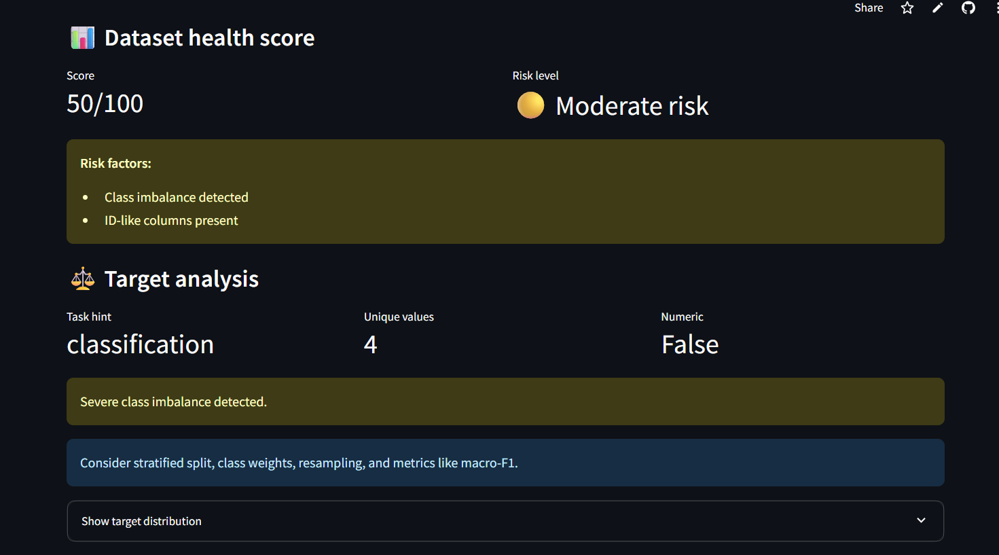
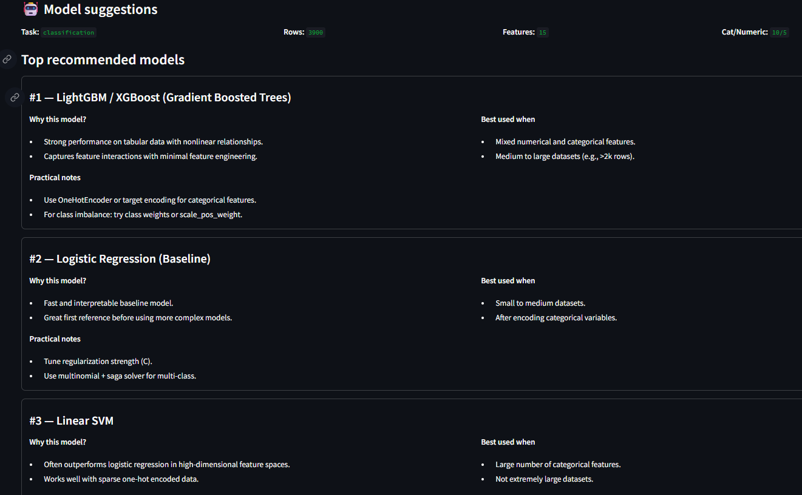

# DataSanity 🧠
Dataset health + ML strategy assistant for tabular machine learning.

**Live demo:** https://datasanity-bg3gimhju65r9q7hhhdsm3.streamlit.app/

## What it does
Upload a CSV, pick a target column, and DataSanity will generate:
- Dataset health score (risk level + reasons)
- Target analysis (classification vs regression hint)
- Checks: missing values, duplicates, constant columns, ID-like columns, leakage (numeric correlation)
- Modeling advice (split strategy + metrics)
- Model suggestions (baselines + stronger tabular models)
- Downloadable HTML report

## Preview



## Run locally
```bash
pip install -r requirements.txt
streamlit run app.py
Project structure
-----------------

*   datasanity/ — core package (checks + reporting)
    
*   app.py — Streamlit UI
    
*   assets/ — styles + screenshots
    

Limitations
-----------

*   Heuristic-based checks (fast diagnostics, not a full data validation framework).
    
*   Leakage detection is currently correlation-based for numeric features.
    